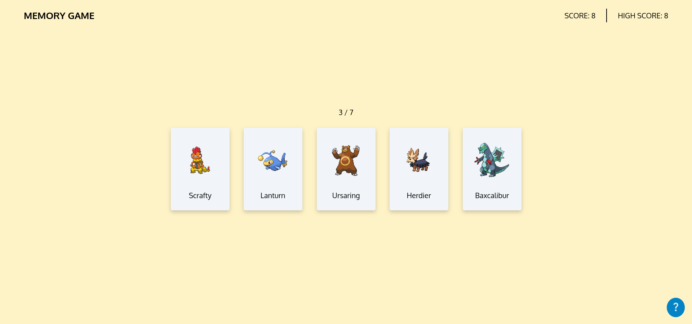

    
    <h1>Memory Game</h1>
    
Application to play a memory card game

    

        <a href="https://sweet-blini-993b74.netlify.app" target="_blank" rel="noreferrer noopener">View Demo</a> · 
        <a href="https://github.com/jotafer19/memory-card/issues" target="_blank" rel="noreferrer noopener">Report Bug</a> ·
        <a href="https://github.com/jotafer19/memory-card/issues" target="_blank" rel="noreferrer noopener"> Request Feature</a>
    

## Preview

### Features

- A webpage built using React and responsive design and with accessibility in mind.
- You can choose between multiple difficulty options, each of them with a different score objective.
- The game saves your high score and updates it accordingly.

### Built With

- 
- 
- 
- 

### Tools Used

- 
- 
- 

## Outcome

- Used React to create the web app.
- Used **Git** and **GitHub** for project management, and **Netlify** to deploy it.
- Tried to maintain **clean code**.

## What I learned

- Deeper understanding of React and `useState` and `useEffect` hook.
- Dealing with API fetching.    

## Acknowledgments

- Inspiration by [**The Odin Project**](https://www.theodinproject.com/lessons/node-path-react-new-memory-card).